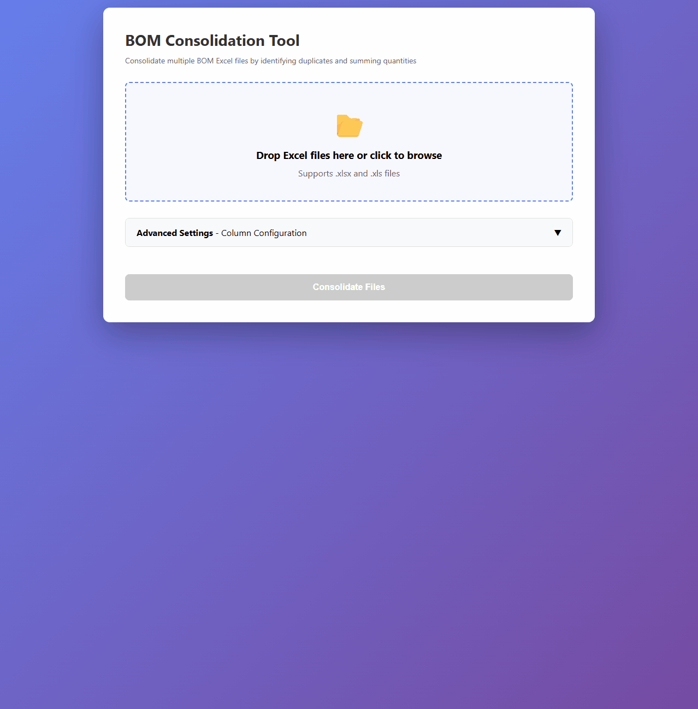

# BOM Item Consolidator

A browser-based tool for consolidating multiple Bill of Materials (BOM) Excel files by identifying duplicate items (based on MFR PART #) and summing their quantities.

## Quick Start

1. Open `bom-consolidator.html` in any modern web browser
2. Upload one or more Excel files (drag & drop or click to browse)
3. Optionally set quantity multipliers for each file (default: 1)
4. Click "Consolidate Files"
5. Download the generated `Consolidated BOM.xlsx` file