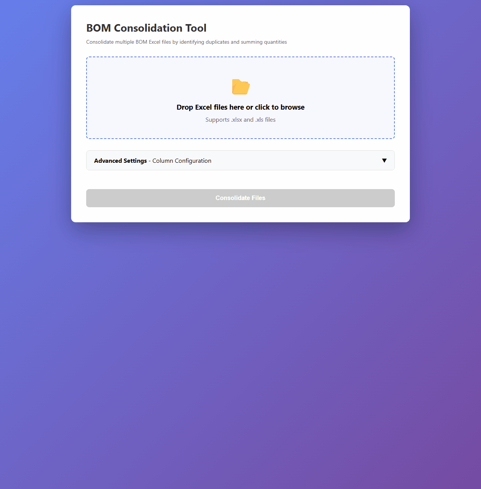
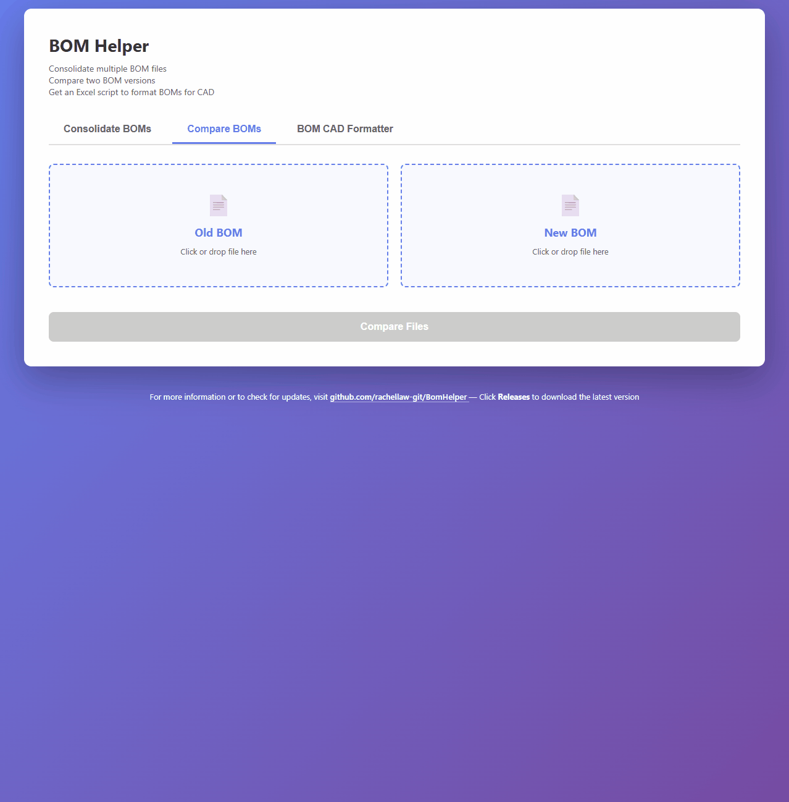

# BOM Helper

**BOM Helper** is a browser-based suite for working with Bill of Materials (BOM) Excel files. It provides two tools:

- **BOM Item Consolidator:** Merge and sum quantities from multiple BOM files.
- **BOM Comparison Tool:** Compare two BOM versions to see added, removed, or changed items.

---

## BOM Item Consolidator

Merge multiple BOM Excel files into a single consolidated BOM. Duplicate items (based on **MFR PART #**) are automatically summed.

### How to Use
1. Open `bom-helper.html` in your browser.
2. Go to the **Consolidate BOMs** tab.
3. Upload one or more Excel files (drag & drop or click to browse).
4. (Optional) Set quantity multipliers for each file.
5. Click **Consolidate Files** to generate a consolidated BOM.
6. Download the generated `Consolidated BOM.xlsx` file.

## BOM Comparison Tool

Compare two BOM Excel files (an old and a new version) to identify changes (based on **MFR PART #**) between revisions.

### How to Use
1. Open `bom-helper.html` in your browser.
2. Go to the **Compare BOMs** tab.
3. Upload an **Old BOM** and a **New BOM** file.
4. Click **Compare Files** to view the differences.
5. Toggle between **Section View** (per section) and **Aggregate View** (by part number).
6. See line items that are added, removed, or have changed quantities.
7. Export the comparison results to Excel or PDF.

---

## Features

- **BOM Item Consolidator:** Merge multiple BOM files, sum quantities for duplicate parts.
- **BOM Comparison Tool:** Identify added, removed, and changed items between two BOM versions.
- **Section & Aggregate Views:** Compare by section or by total part numbers.
- **Export:** Download results as Excel or PDF.

---

## Column Mapping

Both tools expect the following columns in your BOM files:

- **BPP SKU**
- **MFR PART #** (used as the primary key)
- **QTY**
- **MANUFACTURER**
- **DESCRIPTION**